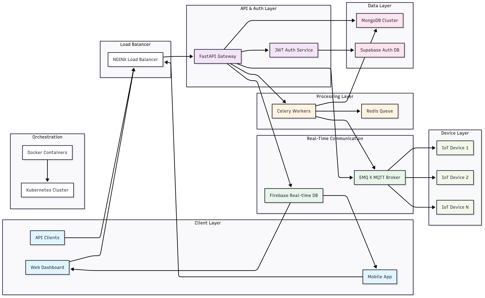
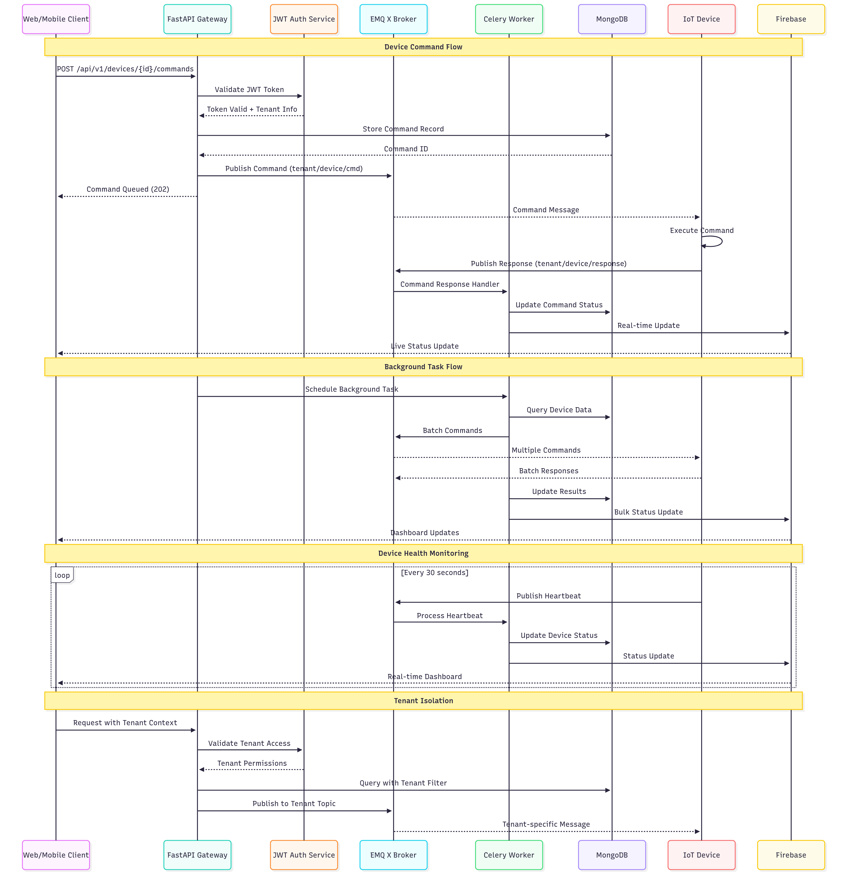

# Multi-Tenant Command & Control System

A scalable platform for remote monitoring and control of distributed devices and systems with tenant isolation and real-time communication capabilities.

## Problem Statement

Modern organizations require centralized control over distributed devices, systems, and processes across multiple departments, or clients. Traditional solutions often lack:

- **Tenant Isolation**: Secure separation of data and operations between different organizations or departments
- **Real-time Communication**: Instant bidirectional communication with remote devices```````````````````````````````````````````````````````````````````````````````````````````````````````````
- **Reliability**: Robust command execution, failure handling, and system monitoring
- **Multi-protocol Support**: Integration with various device types and communication protocols
- **Centralized Management**: Unified dashboard for monitoring, control, and analytics

This creates operational inefficiencies, security vulnerabilities, and scalability bottlenecks that hinder business growth and digital transformation initiatives.

## Description

The Multi-Tenant Command & Control System is a comprehensive IoT and device management platform built on modern cloud-native technologies. It provides a unified interface for monitoring, controlling, and managing distributed devices while ensuring complete tenant isolation and data security.

The platform leverages microservices architecture with containerized deployment, enabling horizontal scaling and fault tolerance. It supports multiple communication protocols, real-time data streaming, and provides extensive APIs for integration with existing systems.

Key architectural components include FastAPI for high-performance APIs, MQTT/EMQ X for reliable device communication, Celery for background processing, MongoDB for flexible data storage, Supabase for authentication, and Firebase for real-time UI updates.

## Features

### Core Platform Features
- **Multi-Tenant Architecture**: Complete isolation of data, users, and resources per tenant
- **Real-time Device Communication**: Bidirectional MQTT messaging with topic-based isolation
- **Scalable API Gateway**: High-performance REST APIs built with FastAPI
- **Background Task Processing**: Asynchronous command execution and batch operations
- **Flexible Data Storage**: Document-based storage optimized for IoT data patterns
- **Real-time Dashboard**: Live updates and notifications via Firebase integration

### Device Management
- **Device Registration & Authentication**: Secure onboarding with certificate-based authentication
- **Health Monitoring**: Real-time device status, performance metrics, and diagnostics
- **Configuration Management**: Centralized device configuration and policy enforcement

### Security & Compliance
- **JWT-based Authentication**: Tenant-aware token management with role-based access
- **End-to-end Encryption**: Secure communication channels for all data transmission
- **Audit Logging**: Comprehensive logging of all commands and system events
- **Data Isolation**: Physical and logical separation of tenant data
- **Permission Management**: Granular access control with custom roles and permissions

### Monitoring & Analytics
- **Real-time Dashboards**: Customizable dashboards with live data visualization
- **Historical Data Analysis**: Time-series data storage and analytics
- **Alert Management**: Configurable alerts with multiple notification channels
- **Performance Metrics**: System and device performance monitoring
- **Reporting Engine**: Automated reports and data export capabilities

### Integration & Extensibility
- **RESTful APIs**: Comprehensive API suite for third-party integrations
- **Webhook Support**: Event-driven notifications to external systems
- **Plugin Architecture**: Extensible framework for custom device protocols
- **Data Export**: Multiple formats (JSON, CSV, XML) for data portability

## How It Can Be Reused in Multiple Fields

### 1. **Robotic Fleet Management**
- **Use Case**: Coordinate and monitor autonomous robots in warehouses, factories, or delivery services
- **Applications**: 
  - Warehouse automation with AGVs (Automated Guided Vehicles)
  - Delivery drone fleet coordination
  - Manufacturing robot orchestration
  - Cleaning robot management in commercial spaces
- **Benefits**: Centralized fleet monitoring, optimized task allocation, predictive maintenance

### 2. **Smart Home Automation**
- **Use Case**: Manage IoT devices across multiple properties or smart home installations
- **Applications**:
  - Property management companies controlling multiple buildings
  - Smart home service providers managing client installations
  - Energy management across residential complexes
  - Security system integration and monitoring
- **Benefits**: Unified control interface, energy optimization, remote diagnostics

### 3. **Industrial Process Control**
- **Use Case**: Monitor and control industrial equipment and processes across multiple facilities
- **Applications**:
  - Manufacturing line automation
  - Power plant monitoring and control
  - Chemical process management
  - Oil and gas pipeline monitoring
- **Benefits**: Real-time process optimization, safety compliance, predictive maintenance

### 4. **Digital Signage Networks**
- **Use Case**: Manage content and display systems across multiple locations
- **Applications**:
  - Retail chain advertising displays
  - Airport information systems
  - Corporate communication networks
  - Public transportation displays
- **Benefits**: Centralized content management, scheduled updates, performance monitoring

### 5. **Autonomous Vehicle Coordination**
- **Use Case**: Coordinate self-driving vehicles in fleet operations
- **Applications**:
  - Ride-sharing autonomous fleet management
  - Autonomous delivery vehicle coordination
  - Public transportation automation
  - Mining and construction vehicle management
- **Benefits**: Route optimization, safety coordination, fleet efficiency

### 6. **Environmental Monitoring**
- **Use Case**: Monitor environmental sensors across multiple locations
- **Applications**:
  - Smart city air quality monitoring
  - Agricultural sensor networks
  - Weather station networks
  - Water quality monitoring systems
- **Benefits**: Real-time environmental data, predictive analytics, compliance reporting

### 7. **Healthcare Device Management**
- **Use Case**: Monitor and manage medical devices across healthcare facilities
- **Applications**:
  - Hospital equipment monitoring
  - Remote patient monitoring devices
  - Medical device fleet management
  - Telemedicine equipment coordination
- **Benefits**: Patient safety, equipment utilization, maintenance scheduling

### 8. **Energy Management Systems**
- **Use Case**: Control and optimize energy consumption across multiple facilities
- **Applications**:
  - Smart grid management
  - Solar panel monitoring
  - Building energy optimization
  - Electric vehicle charging networks
- **Benefits**: Energy efficiency, cost reduction, sustainability reporting

## Architecture Diagram



## Sequence Diagram



## Technology Stack

### Backend Services
- **FastAPI**: High-performance Python web framework for APIs
- **EMQ X**: Scalable MQTT broker for device communication
- **Celery**: Distributed task queue for background processing
- **Redis**: In-memory data store for caching and message queuing

### Data Storage
- **MongoDB**: NoSQL database for flexible device data storage
- **Supabase**: PostgreSQL-based backend for user management

### Real-time Communication
- **Firebase**: Real-time database and push notifications

### Security & Authentication
- **JWT**: JSON Web Tokens for stateless authentication
- **OAuth 2.0**: Standard authorization framework
- **SSL/TLS**: Encrypted communication channels

### Deployment & Orchestration
- **Docker**: Containerization for consistent deployments
- **Kubernetes**: Container orchestration and scaling
- **NGINX**: Load balancing and reverse proxy

## Getting Started

### Prerequisites
- Docker and Docker Compose
- Python 3.9+
- Node.js 16+
- MongoDB instance
- Redis instance

### Quick Start - Example
```bash
# Clone the repository
git clone https://github.com/your-org/multi-tenant-command-control.git
cd multi-tenant-command-control

# Start services with Docker Compose
docker-compose up -d

# Access the dashboard
open http://localhost:8000
```

### Configuration - Example
1. Copy `.env.example` to `.env`
2. Configure database connections
3. Set up Firebase credentials
4. Configure MQTT broker settings
5. Set JWT secret keys

## API Documentation - Example

Once the system is running, access the interactive API documentation at:
- Swagger UI: `http://localhost:8000/docs`
- ReDoc: `http://localhost:8000/redoc`

## Contributing

1. Fork the repository
2. Create a feature branch
3. Commit your changes
4. Push to the branch
5. Create a Pull Request

## 4-Day Development Plan

**Day 1: Project Setup & Authentication System**
* Set up project structure and Docker environment
* Initialize FastAPI backend with required dependencies
* Design tenant and user schemas for MongoDB
* Create JWT authentication and multi-tenant isolation
* Configure EMQ X MQTT broker via Docker

**Day 2: Device Management + MQTT Communication**
* Connect FastAPI to EMQ X via MQTT for device communication
* Implement device registration and authentication APIs
* Define topic patterns for tenant-specific device isolation
* Set up MQTT publisher/subscriber for device commands
* Create basic device status tracking

**Day 3: Real-time Processing + Background Tasks**
* Set up Celery workers for:
   * Scheduled device health monitoring
   * Background command processing
* Integrate Firebase for real-time dashboard updates
* Store device history and command logs in MongoDB
* Begin analytics for device performance insights

**Day 4: Dashboard Interface + Final Documentation**
* Create web dashboard for device monitoring and control
* Build APIs for analytics insights and device history
* Write complete README with setup, usage, and contribution guide
* Clean codebase and prepare deployment configurations

## License - Dummy

This project is licensed under the MIT License - see the [LICENSE] file for details.

## Support - Dummy

For support and questions:
- Create an issue in the GitHub repository
- Check the [documentation](docs/)
- Join our community discussions